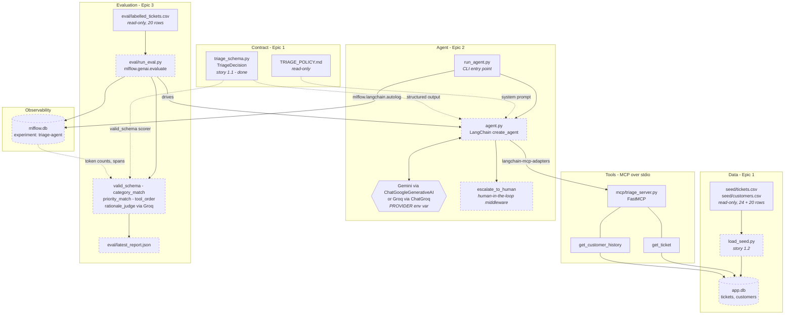
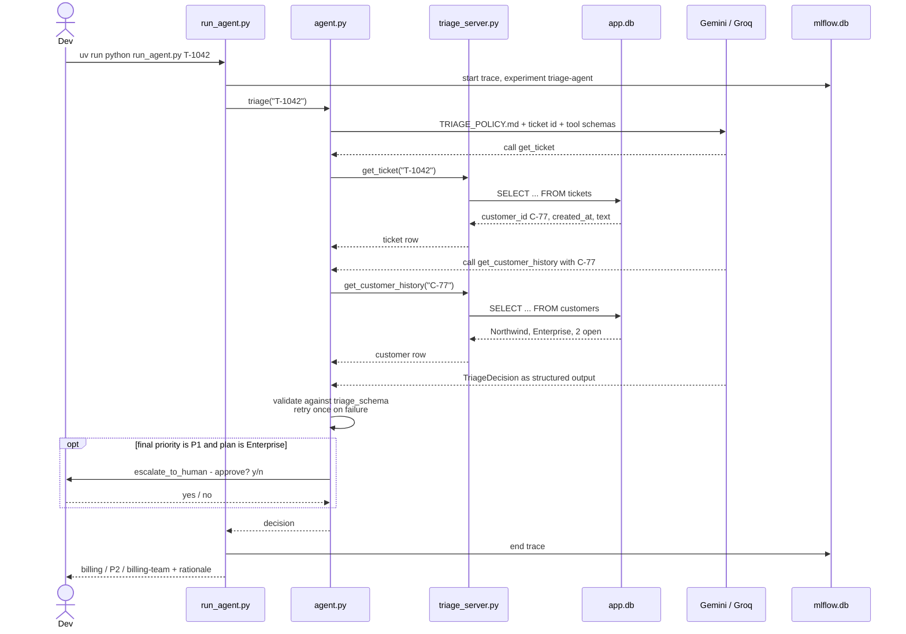
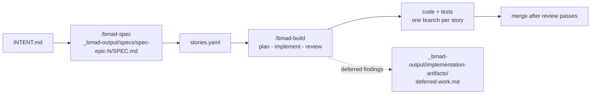

# Architecture

A support-ticket triage agent built spec-first with BMad. A LangChain agent reads a ticket
through two MCP tools over a local SQLite database, applies `TRIAGE_POLICY.md`, and returns a
decision that validates against one shared schema. Every run is traced and evaluated in MLflow.

Solid boxes are built. Dashed boxes are specced but not yet implemented.

## System

## Request flow: one ticket

## Layers and ownership

| Layer | Files | Epic | State |
|---|---|---|---|
| Triage contract | `triage_schema.py`, `tests/` | 1 | Built (story 1.1) |
| Seed data | `seed/*.csv` → `load_seed.py` → `app.db` | 1 | Specced (story 1.2) |
| Policy | `TRIAGE_POLICY.md` | — | Read-only input |
| MCP tools | `mcp/triage_server.py` | pre-built | Built |
| Agent | `run_agent.py`, `agent.py` | 2 | CLI stub only |
| Evaluation | `eval/run_eval.py`, `eval/labelled_tickets.csv` | 3 | Specced |
| Observability | `mlflow.db`, MLflow UI | 2–3 | Wired in the CLI stub |

## Key boundaries

- **One schema, three consumers.** `TriageDecision` is defined once in `triage_schema.py`. The
  agent emits it as LangChain structured output, the eval's `valid_schema` scorer validates
  against it, and the tests pin it. Its vocabularies come from `TRIAGE_POLICY.md`.
- **Route is not coupled to category in the schema.** Set membership is checked; keeping the
  policy's category→route table is the agent's job via its prompt. Likewise `rationale` is only
  checked for being non-empty — "one sentence" is prompt guidance, weighed by the Epic 3 judge.
- **Tools are read-only and come from one server.** `mcp/triage_server.py` over stdio via
  `langchain-mcp-adapters`. `escalate_to_human` deliberately lives outside it, in the agent, so
  it can be gated by human-in-the-loop middleware.
- **Two providers, one code path.** `PROVIDER` selects Gemini or Groq for the agent. The Epic 3
  judge always runs on Groq via `JUDGE_MODEL`, so it never competes for the agent's Gemini quota.
- **Everything lands in MLflow.** Tracking URI is `sqlite:///mlflow.db`, experiment
  `triage-agent`. Each evaluated ticket is one trace, which is what lets the `tool_order` scorer
  see call ordering.
- **Ticket text is untrusted data.** The agent never follows instructions embedded in a ticket.

## Spec-first process

Specs are the contract: change one through `/bmad-spec`, never by editing `SPEC.md` by hand.
